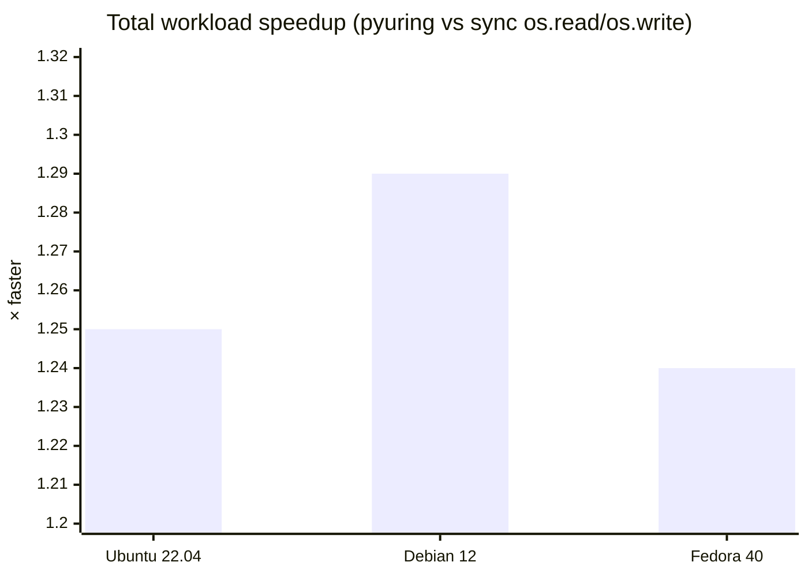

# pyuring

**Repository:** [github.com/kangtegong/pyuring](https://github.com/kangtegong/pyuring) — source tree for the **`pyuring`** Python distribution.

## What this project is

`pyuring` is a **Linux-only** Python library that talks to a small native shared library, **`liburingwrap.so`**, via `ctypes`. That C layer is built on top of **[liburing](https://github.com/axboe/liburing)** and the kernel **io_uring** interface (queue depth, submissions, completions). The bindings are aimed at **high-throughput file copy and synthetic write workloads**, **synchronous and asynchronous** `read`/`write` on open file descriptors, and optional **dynamic buffer sizing** (callbacks implemented in Python for some code paths).

This repository is **not** a complete Python mapping of every liburing opcode or helper. It exposes a **focused subset** implemented in `csrc/` (e.g. pipeline copy/write in C, `UringCtx` for queued I/O, `BufferPool` for fixed-size slots). Treat it as a specialized toolkit and benchmark harness, not a general-purpose async filesystem framework.

| Component | Role |
|-----------|------|
| `pyuring/` | Python package: orchestrated helpers, `UringCtx`, `BufferPool`, module functions backed by the `.so` |
| `csrc/uring_wrap.c` (and related) | Native wrapper around io_uring; built as `build/liburingwrap.so` |
| `Makefile` | Builds the shared library (system or vendored liburing) |
| `third_party/liburing` | Optional vendored liburing (submodule or manual tree) |
| `examples/` | Benchmarks and the `test_dynamic_buffer.py` verification script |

## Requirements

- **OS:** Linux with a kernel that supports io_uring (project documentation assumes **5.15+**).
- **Python:** **3.8+** (see `setup.py`).
- **Build:** `gcc`, `make`, and **liburing development headers** (or a built vendored liburing tree).

## Install

```bash
pip install pyuring
```

From a checkout (builds the native library as part of install):

```bash
git clone --recursive https://github.com/kangtegong/pyuring.git
cd pyuring
pip install -e .
```

System packages for liburing headers when not using the submodule:

| Distribution | Package |
|--------------|---------|
| Debian / Ubuntu | `liburing-dev` |
| Fedora / RHEL | `liburing-devel` |
| Arch Linux | `liburing` |

Details, failures, and manual copy of the `.so` into `pyuring/lib/`: see **[INSTALLATION.md](INSTALLATION.md)**.

## Quick start

**Orchestrated helpers** apply preset queue-depth and block-size tuning via a `mode` argument:

```python
import pyuring as iou

iou.copy("/tmp/source.dat", "/tmp/dest.dat")
iou.write("/tmp/new.dat", total_mb=100)
iou.write_many("/tmp/out", nfiles=10, mb_per_file=100)
```

**Direct bindings** are the same functions and classes as above, grouped on `pyuring.direct` (legacy alias: `pyuring.raw`):

```python
import pyuring as iou

iou.direct.copy_path("/tmp/a.dat", "/tmp/b.dat", qd=32, block_size=1 << 20)

with iou.direct.UringCtx(entries=64) as ctx:
    ...
```

Full parameter tables, `UringCtx` / `BufferPool` methods, and semantics: **[USAGE.md](USAGE.md)**.

## Documentation index

| Document | Contents |
|----------|----------|
| [INSTALLATION.md](INSTALLATION.md) | Dependencies, editable install, vendored liburing, verification |
| [USAGE.md](USAGE.md) | API specification (tables), behavior notes |
| [examples/BENCHMARKS.md](examples/BENCHMARKS.md) | Benchmark scripts |

## Verification

After a local build:

```bash
make && python3 examples/test_dynamic_buffer.py
```

The script must exit with status **0** and print that all checks passed.

If you develop from a git checkout, run tests **from a path like `…/project/examples/`** (or temporarily remove the repo root from `PYTHONPATH`) so `import pyuring` resolves to the **installed** wheel from `pip install pyuring`, not an unbuilt source tree without `liburingwrap.so`.

### `pip install pyuring` on multiple distros (Docker)

These runs use **`docker run --privileged`** (io_uring is often restricted otherwise), install **`liburing` dev headers** and **`pip install pyuring`**, copy only `examples/*.py` under `/proj/examples/` so imports come from site-packages, then execute `test_dynamic_buffer.py` and `bench_async_vs_sync.py` (8 files × 2 MiB, page cache, 3 repeats).

| Environment | Dynamic-buffer tests | Notes |
|-------------|----------------------|--------|
| Ubuntu 22.04 | all passed | `pyuring` from PyPI (sdist build) |
| Debian 12 (bookworm) | all passed | same |
| Fedora 40 | all passed | same |

### Throughput vs. ordinary Python file I/O

The benchmark script [`examples/bench_async_vs_sync.py`](examples/bench_async_vs_sync.py) compares:

| Path | What it does |
|------|----------------|
| **Baseline (“sync”)** | **Synchronous** I/O using `os.open`, `os.write`, `os.read` (and libc `read` where `O_DIRECT` is enabled) in a loop—typical **blocking** file I/O from Python. |
| **pyuring (“async”)** | **`UringCtx`** + **`BufferPool`**: submissions and completions through **io_uring** (same workload shape: chunked read/write of the same files). |

It is **not** compared to `asyncio` or `aiofiles`; it is **blocking POSIX-style I/O vs. this library’s io_uring queue**.

With `--no-odirect`, the workload uses the **page cache** (not raw disk-only `O_DIRECT`). Measured **total** wall time (sync write+read vs async write+read) speedup on the Docker runs above:



Absolute throughput varies with CPU, storage, and kernel; the chart reflects one repeatable configuration. Reproduce:  
`python3 examples/bench_async_vs_sync.py --num-files 8 --file-size-mb 2 --no-odirect --repeats 3`.
