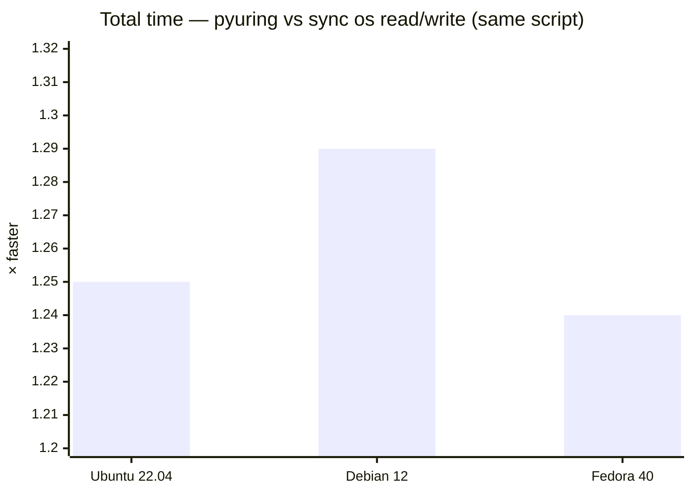

# pyuring

Code: [github.com/kangtegong/pyuring](https://github.com/kangtegong/pyuring)

Linux only. Python loads `liburingwrap.so` through `ctypes`; that shared library is a thin layer over [liburing](https://github.com/axboe/liburing) and the kernel’s io_uring. You get helpers for big copies and bulk writes, read/write around real fds, and optional Python callbacks where the C side asks for a buffer size. It is not a full liburing binding—think of it as a small, opinionated slice with some of the heavy work still in `csrc/`.

Rough map: `pyuring/` is the package, `csrc/` builds to `liburingwrap.so`, the `Makefile` drives that build, `third_party/liburing` is there if you vendor liburing, and `examples/` holds benchmarks plus `test_dynamic_buffer.py`.

**Needs:** Linux (docs assume kernel 5.15+), Python 3.8+, and a working toolchain plus liburing headers when you build from source.

## Install

```bash
pip install pyuring
```

From git (submodule for liburing if you use it):

```bash
git clone --recursive https://github.com/kangtegong/pyuring.git
cd pyuring
pip install -e .
```

Debian/Ubuntu: `liburing-dev`. Fedora/RHEL: `liburing-devel`. Arch: `liburing`. If the build complains, see [INSTALLATION.md](INSTALLATION.md).

## Usage

`copy`, `write`, and `write_many` pick queue depth / block size from a `mode` flag so you do not have to tune everything by hand:

```python
import pyuring as iou

iou.copy("/tmp/source.dat", "/tmp/dest.dat")
iou.write("/tmp/new.dat", total_mb=100)
iou.write_many("/tmp/out", nfiles=10, mb_per_file=100)
```

The same primitives live under `pyuring.direct` if you want the raw knobs (`pyuring.raw` is the old name, still there).

```python
import pyuring as iou

iou.direct.copy_path("/tmp/a.dat", "/tmp/b.dat", qd=32, block_size=1 << 20)

with iou.direct.UringCtx(entries=64) as ctx:
    ...
```

Full API tables: [USAGE.md](USAGE.md). Install and build notes: [INSTALLATION.md](INSTALLATION.md). Benchmark invocations: [examples/BENCHMARKS.md](examples/BENCHMARKS.md).

## Tests

After a local build:

```bash
make && python3 examples/test_dynamic_buffer.py
```

If you installed from PyPI and want to run those scripts from a checkout, run them from a directory that does **not** put the repo root on `PYTHONPATH` first—otherwise `import pyuring` can pick up the tree without a built `.so` and fail.

We also smoke-tested `pip install pyuring` inside Docker on Ubuntu 22.04, Debian bookworm, and Fedora 40 (privileged container, liburing headers, example scripts copied to something like `/proj/examples/` so imports resolve to site-packages). `test_dynamic_buffer.py` passed on all three.

## Benchmark vs plain `os` read/write

[`examples/bench_async_vs_sync.py`](examples/bench_async_vs_sync.py) times two implementations of the same pattern: chunked read/write over the same files. One path uses `os.open` / `os.write` / `os.read` in the obvious synchronous loop. The other uses `UringCtx` and `BufferPool` on top of io_uring. That is the comparison—it is **not** meant to mirror `asyncio` or `aiofiles`.

With `--no-odirect` you mostly hit the page cache. The chart is total wall time (write+read) for 8×2 MiB files, three averaged runs, in those Docker setups:



Your numbers will move with CPU, disk, and kernel. To reproduce:

`python3 examples/bench_async_vs_sync.py --num-files 8 --file-size-mb 2 --no-odirect --repeats 3`
