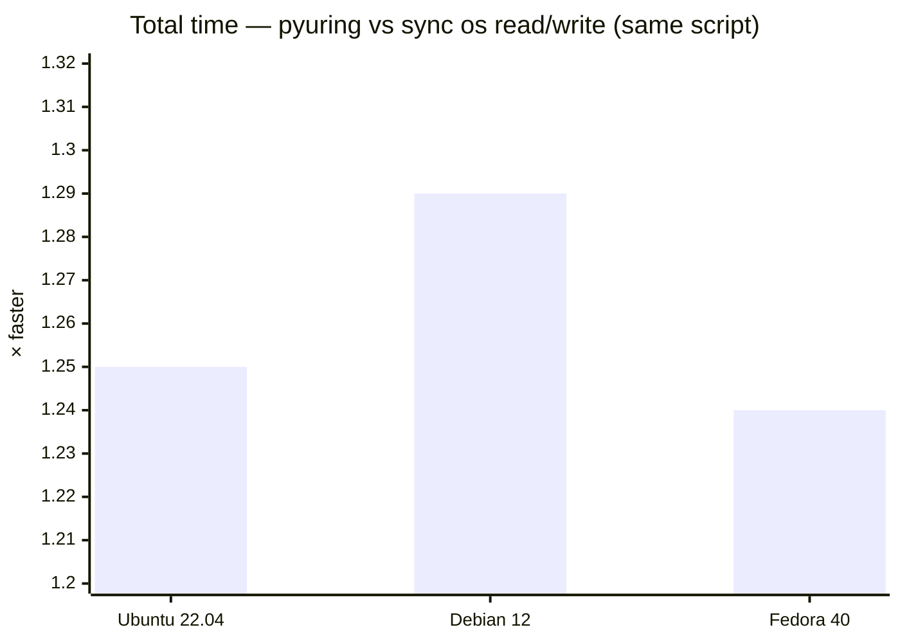

# pyuring

Code: [github.com/kangtegong/pyuring](https://github.com/kangtegong/pyuring)

Linux only. Python loads `liburingwrap.so` through `ctypes`. That library links [liburing](https://github.com/axboe/liburing) and uses the kernel io_uring interface. The package exposes file copy and bulk-write entry points, read/write operations on open file descriptors, and optional Python callbacks used by the native code when dynamic buffer sizing is enabled. The Python API does not cover all of liburing; additional logic resides in `csrc/`.

**Layout:** `pyuring/` — Python package; `csrc/` — sources for `liburingwrap.so`; `Makefile` — builds that shared object; `third_party/liburing` — optional vendored liburing tree; `examples/` — benchmark scripts and `test_dynamic_buffer.py`.

**Needs:** Linux (docs assume kernel 5.15+), Python 3.8+, and a working toolchain plus liburing headers when you build from source.

## Install

```bash
pip install pyuring
```

From git (submodule for liburing if you use it):

```bash
git clone --recursive https://github.com/kangtegong/pyuring.git
cd pyuring
pip install -e .
```

Debian/Ubuntu: `liburing-dev`. Fedora/RHEL: `liburing-devel`. Arch: `liburing`. If installation fails, see [INSTALLATION.md](INSTALLATION.md).

## API reference (overview)

The package loads native code from `liburingwrap.so`. Operations that fail in the C layer raise **`UringError`** (`RuntimeError` subclass); error strings typically include a negated errno.

**Exports.** Public symbols are available from the package root (`from pyuring import copy, UringCtx, …`). The namespace object **`pyuring.direct`** exposes the same callables and types as attributes. **`pyuring.raw`** is a backward-compatible alias of **`pyuring.direct`**.

Complete parameter lists, defaults, and per-method tables: **[USAGE.md](USAGE.md)**.

### Orchestrated helpers

These functions select queue depth and block size from **`mode`** (`"safe"` | `"fast"` | `"auto"`) before invoking the native implementation. Keyword-only arguments not shown below are listed in USAGE.md.

| Name | Signature (summary) | Return value |
|------|---------------------|--------------|
| **`copy`** | `copy(src_path, dst_path, *, mode="auto", qd=32, block_size=1<<20, fsync=False, buffer_size_cb=None)` | **`int`** — bytes copied. |
| **`write`** | `write(dst_path, *, total_mb, mode="auto", qd=256, block_size=4096, fsync=False, dsync=False, buffer_size_cb=None)` | **`int`** — bytes written. |
| **`write_many`** | `write_many(dir_path, *, nfiles, mb_per_file, mode="auto", qd=256, block_size=4096, fsync_end=False)` | **`int`** — total bytes written across files. |

**Behavior.** For **`mode="auto"`**, **`copy`** and **`write`** use the dynamic-buffer native entry points (`copy_path_dynamic`, `write_newfile_dynamic`) with a built-in adaptive **`buffer_size_cb`** unless the caller supplies one. **`write_many`** always calls **`write_manyfiles`**; **`mode`** only adjusts **`qd`** and **`block_size`** presets.

### Native pipeline functions

These functions map directly to the shared library. They are importable at package level and as attributes of **`pyuring.direct`** / **`pyuring.raw`**.

| Name | Signature (summary) | Return value |
|------|---------------------|--------------|
| **`copy_path`** | `copy_path(src_path, dst_path, *, qd=32, block_size=1<<20)` | **`int`** |
| **`copy_path_dynamic`** | `copy_path_dynamic(src_path, dst_path, *, qd=32, block_size=1<<20, buffer_size_cb=None, fsync=False)` | **`int`** |
| **`write_newfile`** | `write_newfile(dst_path, *, total_mb, block_size=4096, qd=256, fsync=False, dsync=False)` | **`int`** |
| **`write_newfile_dynamic`** | `write_newfile_dynamic(dst_path, *, total_mb, block_size=4096, qd=256, fsync=False, dsync=False, buffer_size_cb=None)` | **`int`** |
| **`write_manyfiles`** | `write_manyfiles(dir_path, *, nfiles, mb_per_file, block_size=4096, qd=256, fsync_end=False)` | **`int`** |

Path arguments are **`str`**. Optional **`buffer_size_cb`** callbacks receive **`(current_offset, total_bytes, default_block_size)`** and return an **`int`** buffer size where documented in USAGE.md.

### Classes

**`class UringCtx`**

- **Construction:** `UringCtx(lib_path=None, entries=64)` — loads **`lib_path`**, or resolves **`liburingwrap.so`** automatically when **`lib_path`** is **`None`**.
- **Synchronous I/O:** **`read`**, **`write`**, **`read_batch`**, **`read_offsets`** (see USAGE.md for arguments and return types).
- **Asynchronous I/O:** **`read_async`**, **`write_async`**, **`read_async_ptr`**, **`write_async_ptr`**; completion polling via **`wait_completion`**, **`peek_completion`**; submission via **`submit`**, **`submit_and_wait`**.
- **Resource management:** **`close()`**; supports **`with`** statement.

**`class BufferPool`**

- **Construction:** class method **`BufferPool.create(initial_count=8, initial_size=4096)`**.
- **Instance methods:** **`resize`**, **`get`**, **`get_ptr`**, **`set_size`**, **`close`**; context manager supported.

**`class UringError`**

- Base: **`RuntimeError`**. Raised when native entry points report failure.

### Other documentation

- Installation and build: **[INSTALLATION.md](INSTALLATION.md)**  
- Benchmarks: **[examples/BENCHMARKS.md](examples/BENCHMARKS.md)**

## Quick examples

```python
import pyuring as iou

iou.copy("/tmp/source.dat", "/tmp/dest.dat")
iou.write("/tmp/new.dat", total_mb=100)
iou.write_many("/tmp/out", nfiles=10, mb_per_file=100)
```

Lower-level, same symbols as top-level imports:

```python
import pyuring as iou

iou.direct.copy_path("/tmp/a.dat", "/tmp/b.dat", qd=32, block_size=1 << 20)

with iou.direct.UringCtx(entries=64) as ctx:
    ...
```

## Tests

After a local build:

```bash
make && python3 examples/test_dynamic_buffer.py
```

If you installed from PyPI and want to run those scripts from a checkout, run them from a directory that does **not** put the repo root on `PYTHONPATH` first—otherwise `import pyuring` can pick up the tree without a built `.so` and fail.

`pip install pyuring` was also verified in Docker (privileged, liburing development packages installed) on Ubuntu 22.04, Debian bookworm, and Fedora 40. Example scripts were run from a directory layout where `import pyuring` resolves to the installed package (not an unbuilt source tree on `PYTHONPATH`). `test_dynamic_buffer.py` completed successfully on all three.

## Benchmark vs plain `os` read/write

[`examples/bench_async_vs_sync.py`](examples/bench_async_vs_sync.py) measures wall-clock time for two implementations of the same workload (chunked read/write over the same files). One implementation uses `os.open`, `os.write`, and `os.read` in a synchronous loop. The other uses `UringCtx` and `BufferPool` with io_uring submission and completion. This benchmark does **not** compare against `asyncio` or `aiofiles`.

With `--no-odirect`, I/O goes through the page cache (see script: `O_DIRECT` is disabled). The chart below reports total elapsed time (write phase plus read phase) for 8 files × 2 MiB, mean of three runs, in the Docker environments listed on the axes:



Throughput and speedup depend on CPU, storage, and kernel. To reproduce:

`python3 examples/bench_async_vs_sync.py --num-files 8 --file-size-mb 2 --no-odirect --repeats 3`
