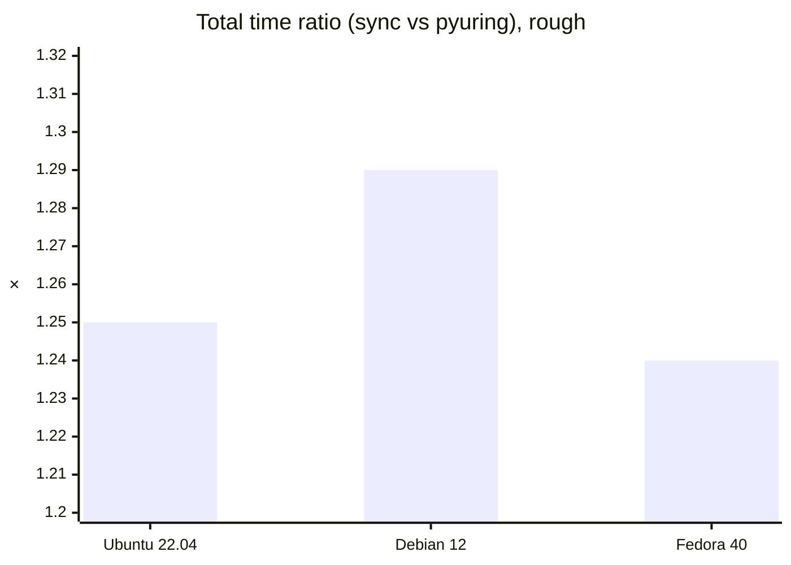

# pyuring

Linux-only bindings: Python loads `liburingwrap.so` through `ctypes`, and that shared library talks to the kernel via [liburing](https://github.com/axboe/liburing) / io_uring. The focus is chunky file work—copy pipelines, big writes, queued `read`/`write`, and optional buffer sizing with Python callbacks on some paths.

It does **not** wrap all of liburing. What exists lives under `csrc/`—a C-side copy/write pipeline, `UringCtx`, `BufferPool`, that sort of thing. Good for benchmarks and experiments; don’t expect a general-purpose async FS layer.

Repo: [github.com/kangtegong/pyuring](https://github.com/kangtegong/pyuring).

## What you need

A kernel that actually runs io_uring (we’ve been assuming 5.15+). Python 3.8+. To build from source: `gcc`, `make`, and liburing headers—or the vendored tree under `third_party/`.

## Install

```bash
pip install pyuring
```

From git: clone (submodules if you want vendored liburing), then `pip install -e .` — that build step produces the `.so`.

Headers: Debian/Ubuntu `liburing-dev`, Fedora-ish `liburing-devel`, Arch `liburing`. When the build explodes, see [INSTALLATION.md](INSTALLATION.md).

## Quick use

`copy`, `write`, `write_many` pick conservative/aggressive-ish queue depth and block size from `mode`:

```python
import pyuring as iou

iou.copy("/tmp/source.dat", "/tmp/dest.dat")
iou.write("/tmp/new.dat", total_mb=100)
iou.write_many("/tmp/out", nfiles=10, mb_per_file=100)
```

The same functions/classes are also grouped under `pyuring.direct` (older alias: `pyuring.raw`).

```python
import pyuring as iou

iou.direct.copy_path("/tmp/a.dat", "/tmp/b.dat", qd=32, block_size=1 << 20)

with iou.direct.UringCtx(entries=64) as ctx:
    ...
```

Full API: [USAGE.md](USAGE.md).

## More docs

[INSTALLATION.md](INSTALLATION.md) — deps, vendored liburing, when the `.so` ends up in `pyuring/lib/`.  
[USAGE.md](USAGE.md) — parameters, methods.  
[examples/BENCHMARKS.md](examples/BENCHMARKS.md) — benchmark scripts.

## Tests

```bash
make && python3 examples/test_dynamic_buffer.py
```

If you `pip install pyuring` but still run scripts from inside a checkout, Python may import the **tree** first and miss the built `.so`. Run examples from somewhere that isn’t the repo root, or drop the repo from `PYTHONPATH`, so you actually hit the installed package.

### Docker / PyPI smoke

We’ve run the PyPI sdist in Docker with `--privileged` (io_uring often dies without it), liburing dev packages installed, and only the example scripts copied to e.g. `/proj/examples/` so imports resolve to site-packages. Ubuntu 22.04, Debian bookworm, Fedora 40—all passed `test_dynamic_buffer.py` that way.

## Benchmark (rough)

[`bench_async_vs_sync.py`](examples/bench_async_vs_sync.py) pits plain synchronous `os.open` / `os.write` / `os.read` loops against `UringCtx` + `BufferPool` on the same file set. That’s **not** “vs asyncio” or aiofiles—just blocking POSIX-style I/O vs this library’s io_uring path. With `--no-odirect` you’re mostly in page-cache territory.

Numbers below are total wall time (sync write+read vs async write+read), 8×2 MiB files, `--no-odirect`, 3 repeats—same Docker setup as above. Your box will differ.



Reproduce: `python3 examples/bench_async_vs_sync.py --num-files 8 --file-size-mb 2 --no-odirect --repeats 3`
