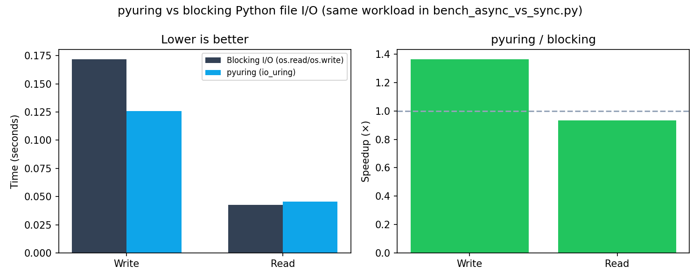

# Docker verification and throughput vs blocking I/O

This report records a **reproducible** check that `pip install pyuring` works in a clean Linux environment, and compares **pyuring** (`UringCtx` + `BufferPool` + io_uring async read/write) against the **baseline** implemented in `examples/bench_async_vs_sync.py`.

## What “baseline Python I/O” means (exactly)

The benchmark script’s **Sync** path is **blocking file I/O in Python**, not a separate library:

| Piece | Role |
|--------|------|
| `os.open` / `os.close` | File descriptors |
| **`os.write`** | Write path when `O_DIRECT` is off (`--no-odirect`) |
| **`os.read`** | Read path when `O_DIRECT` is off |
| **`libc.read`** via `ctypes` | Used when `O_DIRECT` is on (aligned buffers); still synchronous, one syscall batch per chunk |

The **Async** path uses **`pyuring.UringCtx`**: `write_async_ptr` / `read_async_ptr`, `submit`, `wait_completion`, with buffers from **`BufferPool`** — i.e. the **io_uring** queue in the wrapper `liburingwrap.so`.

So the comparison is **same workload** (many files × fixed size), **same Python process**, differing only in **sync syscalls per chunk** vs **uring submission/completion**.

## Docker setup

- **Image:** `docker/Dockerfile.verify` — Ubuntu 22.04, `liburing-dev`, `gcc`, `make`, then **`pip install pyuring matplotlib`** and copy **`examples/`** only (no git checkout of the package sources).
- **io_uring inside Docker:** the default Docker seccomp profile can block io_uring-related syscalls and yield `Operation not permitted`. Runs that exercise pyuring use:

  ```bash
  docker run --rm --privileged pyuring-verify:local …
  ```

  For production CI, prefer a **custom seccomp** that allows the needed syscalls instead of full `--privileged` if your security model requires it.

## Functional checks (pip-installed package)

```bash
docker build -f docker/Dockerfile.verify -t pyuring-verify:local .
docker run --rm --privileged pyuring-verify:local python3 examples/test_dynamic_buffer.py
```

All three scenarios in `test_dynamic_buffer.py` **passed** (`copy_path_dynamic`, `write_newfile_dynamic`, linear buffer strategy).

## Throughput benchmark (saved artifacts)

Command (also stored in `docs/data/docker_bench_log.txt`):

```bash
docker run --rm --privileged pyuring-verify:local \
  python3 examples/bench_async_vs_sync.py \
  --num-files 20 --file-size-mb 5 --repeats 3 --no-odirect
```

Settings: **20 files × 5 MiB**, **queue depth 32**, **3 repetitions**, **page cache** (`--no-odirect` — no `O_DIRECT`).

### Summary numbers (averages over 3 repeats)

| Operation | Avg time (s) | Avg throughput (MiB/s) | Ratio vs sync* |
|-----------|--------------|-------------------------|----------------|
| Sync Write | 0.172 | 581.5 | 1.00× |
| **Async Write (pyuring)** | **0.126** | **793.7** | **1.36×** faster |
| Sync Read | 0.0425 | 2352 | 1.00× |
| Async Read (pyuring) | 0.0455 | 2198 | **0.93×** (slower) |

\*“Ratio vs sync” for async rows is **sync_time / async_time** from the script’s table (same as printed **Speedup** for writes).

**Interpretation:** With **page cache hot**, **writes** overlap well with io_uring and show a clear **~1.36×** wall-clock gain in this run. **Reads** can be **slightly slower** asynchronously here: completions + Python overhead may not beat a tight **read loop** when data is already cached — this is a known pattern when comparing async vs sync on **buffer cache** workloads.

End-to-end (write + read phases as printed by the script): **~1.25×** total time improvement for this scenario.

### Figure (from `docs/data/bench_parsed.json`)



Generated on the host with:

```bash
python3 scripts/parse_bench_log.py < docs/data/docker_bench_log.txt > docs/data/bench_parsed.json
python3 scripts/plot_benchmark_json.py docs/data/bench_parsed.json docs/images/benchmark_docker.png
```

## Reproduce

```bash
docker build -f docker/Dockerfile.verify -t pyuring-verify:local .
docker run --rm --privileged pyuring-verify:local python3 examples/test_dynamic_buffer.py
docker run --rm --privileged pyuring-verify:local python3 examples/bench_async_vs_sync.py \
  --num-files 20 --file-size-mb 5 --repeats 3 --no-odirect | tee docs/data/docker_bench_log.txt
```

Then parse/plot as above. Kernel, CPU governor, and storage backing `/tmp` will change absolute numbers; the **relative** sync vs async pattern is what this script measures.
