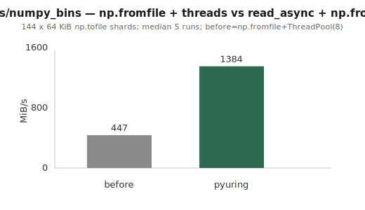
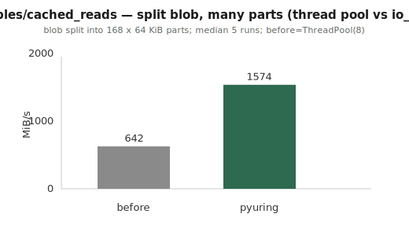
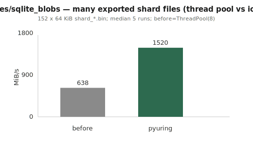

# Example throughput charts

Bar charts for [`examples/README.md`](https://github.com/kangtegong/pyuring/blob/main/examples/README.md): **MiB/s**, **before** vs **pyuring**.

Workloads are **many small/medium files** (thread pool or `asyncio.gather`+executor vs batched io_uring), where batching usually favors pyuring. Regenerate with:

`pip install numpy`

`PYTHONPATH=. python3 scripts/gen_example_graphs.py`

## PyTorch-style (many shards)

## asyncio (many files)

## FastAPI (many on-disk reads per batch)

## NumPy shards (`numpy_bins`)

## Cached blob split into parts (`cached_reads`)

## SQLite-export-style shard files (`sqlite_blobs`)

