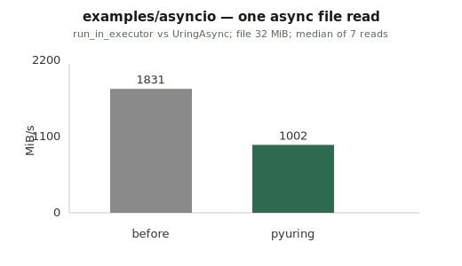
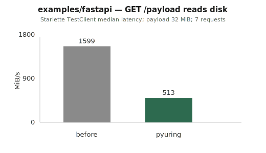
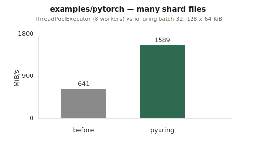

# Example throughput charts

Bar charts from [`examples/README.md`](https://github.com/kangtegong/pyuring/blob/main/examples/README.md) (MiB/s, **before** vs **pyuring**).

## asyncio

## FastAPI

## PyTorch-style shards

