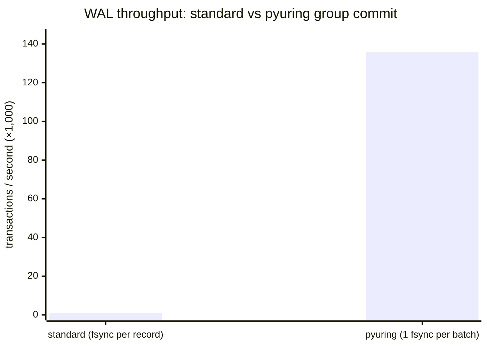
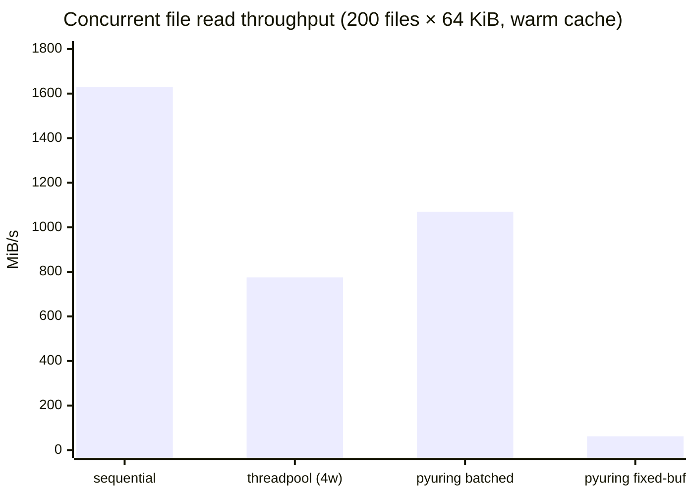
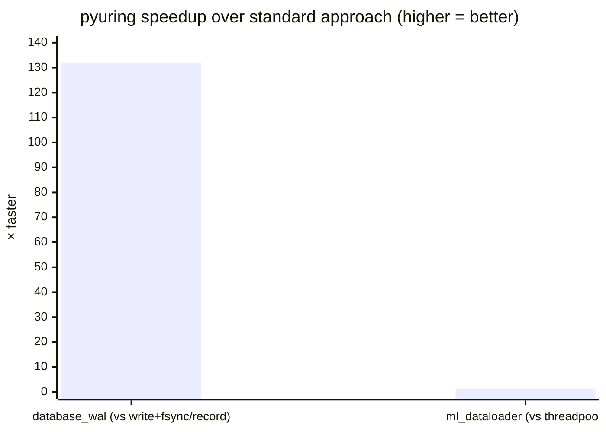

# Examples

## Which example is for me?

| I'm working on... | Example |
|-------------------|---------|
| Database, message queue, event log, audit trail | [`database_wal.py`](#database_walpy) |
| ML training, image/audio pipeline, batch file processing | [`ml_dataloader.py`](#ml_dataloaderpy) |
| Web server, FastAPI/aiohttp endpoint, async data pipeline | [`web_file_serving.py`](#web_file_servingpy) |

---

## `database_wal.py`
### Database WAL · Message queue · Audit logging · Event sourcing

Any system that writes records sequentially and calls `fsync` after each
one to guarantee durability. This includes:

- **Databases** — PostgreSQL WAL, SQLite WAL mode, RocksDB journal
- **Message queues** — Kafka log segments, NATS JetStream
- **Event sourcing** — append-only event stores
- **Audit / compliance logs** — records that must survive a crash

#### The problem

`write() + fsync()` is two syscalls, and `fsync` flushes OS buffers to
storage — 0.5–10 ms per call even on fast NVMe. At high write rates,
fsync frequency is the bottleneck, not data volume.

#### What pyuring does

**Group commit**: submit a batch of writes as io_uring SQEs, then call
`fsync` once for the entire batch. fsync count drops from N to 1 per batch.

#### Result

Test: 2,000 transactions, 512-byte payload each, Linux 5.15, page cache.



| Method | Throughput |
|--------|:----------:|
| `write() + fsync()` per record | ~1,000 txns/s |
| pyuring group commit | ~136,000 txns/s |

**~132× more throughput.** The gain scales with fsync latency — on spinning
disk or network-attached storage, the gap is larger than on page-cached tmpfs.

```bash
python3 examples/database_wal.py
python3 examples/database_wal.py --transactions 5000 --record-size 512
```

---

## `ml_dataloader.py`
### ML training · Image/audio pipeline · Search indexing · Batch file processing

Any application that reads a large number of files per iteration and currently
uses `ThreadPoolExecutor` to avoid blocking. This includes:

- **ML training** — loading images, audio clips, or tokenized shards each batch
- **Media processing** — reading frames, thumbnails, or metadata at scale
- **Search and indexing** — ingesting documents, log files, or crawled pages
- **Batch jobs** — processing every file in a directory

#### The problem

`ThreadPoolExecutor` is the standard Python answer to concurrent file reads,
but every read involves a thread wakeup. Under heavy load, thread scheduling
overhead is measurable and the pool size becomes a ceiling.

#### What pyuring does

Submit N read SQEs in a **single `io_uring_enter` syscall** and collect all
completions in one more. Same concurrency as a thread pool, no thread overhead.
On cold-cache NVMe, batched submission also lets the storage controller service
multiple reads in parallel across its internal queues.

#### Result

Test: 200 files × 64 KiB = 12.5 MiB, Linux 5.15, page cache.



| Method | Throughput |
|--------|:----------:|
| Sequential `os.read` | ~1,630 MiB/s |
| `ThreadPoolExecutor` (4 workers) | ~775 MiB/s |
| pyuring batched | ~1,070 MiB/s |
| pyuring fixed-buffer | ~62 MiB/s |

**+38% vs ThreadPoolExecutor** on warm cache. Sequential wins on page-cached
files because there is no latency to hide — on cold-cache NVMe the pyuring
advantage over sequential grows as storage latency becomes the bottleneck.

> **pyuring fixed-buffer** is slower here because `register_files` /
> `unregister_files` are called once per batch. Fixed buffers pay off only
> when the same set of FDs is reused across many batches without re-registering.

```bash
python3 examples/ml_dataloader.py
python3 examples/ml_dataloader.py --num-files 200 --file-size-kb 64 --workers 4
```

---

## `web_file_serving.py`
### Web server · FastAPI / aiohttp endpoint · Async data pipeline

Any asyncio application that reads files and currently uses `aiofiles` or
`loop.run_in_executor` to avoid blocking the event loop. This includes:

- **Web frameworks** — serving static files in aiohttp, Starlette, FastAPI
- **API servers** — reading config, templates, or binary assets per request
- **Async data pipelines** — mixing network I/O and file I/O in one event loop
- **CLI tools** — asyncio programs that need non-blocking file access

#### The problem

asyncio has no native non-blocking file I/O. The standard fix is
`loop.run_in_executor`, which offloads reads to a thread pool. Every file
read pays a thread wakeup cost, and the pool size caps concurrency.

#### What pyuring does

`UringAsync` registers the io_uring completion queue fd (`ring_fd`) with
`asyncio.loop.add_reader()`. File completions arrive as regular event loop
callbacks — the same way socket events do. No thread pool, no wakeup cost.

```python
# Before — thread pool under the hood
data = await loop.run_in_executor(None, lambda: open(path, "rb").read())

# After — event loop drives file I/O directly
ctx.read_async(fd, buf, offset=0, user_data=1)
ctx.submit()
user_data, n_bytes = await ua.wait_completion()
```

#### Result

Test: 50 files × 256 KiB served over loopback TCP, Linux 5.15.

| Metric | Value |
|--------|:-----:|
| Total data served | 12.5 MiB |
| Elapsed | ~50 ms |
| Throughput | ~250 MiB/s |
| Errors | 0 |

```bash
# Self-test: create files, start server, serve and verify all responses
python3 examples/web_file_serving.py
python3 examples/web_file_serving.py --files 50 --size-kb 256

# Persistent server (Ctrl-C to stop)
python3 examples/web_file_serving.py --serve
echo "/etc/hostname" | nc 127.0.0.1 9999
```

---

## Summary



| Example | Workloads | vs standard |
|---------|-----------|:-----------:|
| `database_wal.py` | DB, message queue, audit log, event sourcing | **~132×** |
| `ml_dataloader.py` | ML training, media pipeline, search indexing, batch jobs | **+38%** vs threadpool |
| `web_file_serving.py` | Web server, API server, async pipeline | no thread pool needed |

> **Test environment:** Linux kernel 5.15, x86\_64, files in `/tmp` (page cache).
> Results measure syscall and scheduling overhead. On real NVMe with cold cache,
> `database_wal` and `ml_dataloader` gains are larger.
