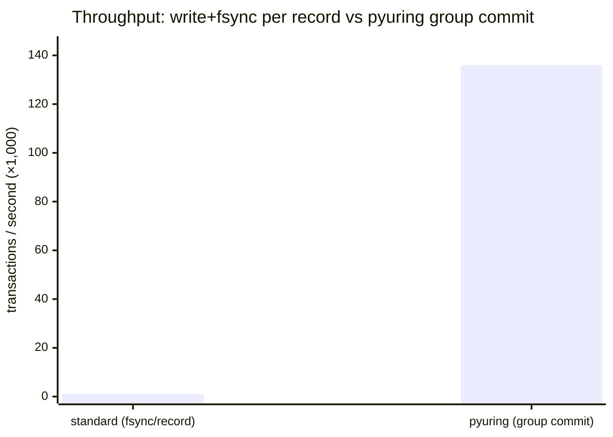
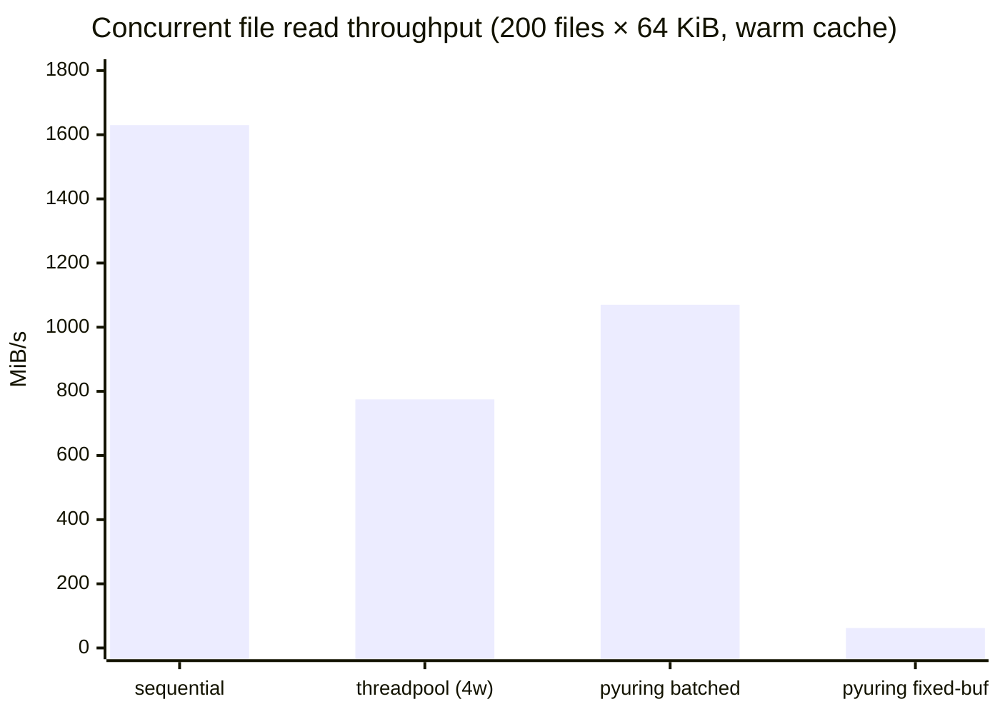
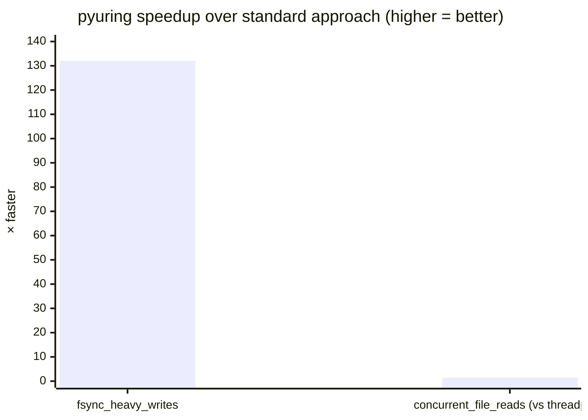

# Examples

Three examples covering the workload patterns where pyuring provides the clearest benefit.
Each file is self-contained and runnable with no extra dependencies beyond pyuring.

| File | When to reach for it |
|------|----------------------|
| [`fsync_heavy_writes.py`](#fsync_heavy_writespy) | You call `fsync` after every write and throughput is the bottleneck |
| [`concurrent_file_reads.py`](#concurrent_file_readspy) | You use `ThreadPoolExecutor` to read many files and want less overhead |
| [`asyncio_file_io.py`](#asyncio_file_iospy) | You have an asyncio app that reads files and want to avoid `run_in_executor` |

---

## When pyuring helps

**High fsync frequency.** Any application that calls `fsync` per committed record pays
0.5–10 ms per call on real storage. The number of `fsync` calls dominates total write time,
not the amount of data written. Batching records and calling `fsync` once per batch
(group commit) is the single most effective optimization for this class of workload.

**Many concurrent file reads.** `ThreadPoolExecutor` is the standard Python answer
to concurrent file reads, but every read involves a thread wakeup. Under high load,
thread scheduling overhead is measurable. pyuring submits N reads in one syscall
and collects completions in another — same concurrency, no threads.

**File I/O inside asyncio.** asyncio has no native non-blocking file I/O.
The usual workaround is `loop.run_in_executor`, which hands off to a thread pool.
`UringAsync` registers the io_uring completion queue fd with the event loop directly,
so file completions arrive as regular asyncio events with no background threads.

---

## `fsync_heavy_writes.py`

### What workloads this covers

Any application that appends records to a file and calls `fsync` (or `fdatasync`)
before confirming each record to the caller:

- Databases — WAL in PostgreSQL, SQLite, RocksDB
- Message queues — Kafka log segments, NATS JetStream
- Event sourcing systems — append-only event logs
- Audit and compliance logs — every entry must survive a crash
- Any service where a write is not "committed" until it is on disk

### What pyuring enables

The group-commit pattern: submit all pending records as a batch of SQEs,
then call `fsync` once for the whole batch. The throughput difference comes
entirely from reducing the number of `fsync` calls, not from faster write speed.

### Result

Test conditions: 2,000 transactions, 512-byte payload per record, Linux 5.15, page cache.
Standard path is measured at 500 transactions to keep runtime reasonable.

```
Standard   write() + fsync() per txn:  ~1,000 txns/s
pyuring    group commit (1 fsync/batch): ~136,000 txns/s
```



**~132× more transactions per second.**

On real NVMe storage (not page cache), each `fsync` costs more, so the gap grows larger.

### Key trade-off

Group commit reduces per-record durability: if the process crashes after 500 records
are written but before the final `fsync`, all 500 are lost. For strict per-record
durability with lower overhead than separate `fsync` calls, use `sync_policy="data"`
(`RWF_DSYNC` per write) or chain write + fsync SQEs with `IOSQE_IO_LINK`.

```bash
python3 examples/fsync_heavy_writes.py
python3 examples/fsync_heavy_writes.py --transactions 5000 --record-size 512
```

---

## `concurrent_file_reads.py`

### What workloads this covers

Any application that reads a large number of files and currently uses
`ThreadPoolExecutor` to avoid blocking:

- ML training pipelines — images, audio clips, tokenized shards per batch
- Media processing — reading frames, thumbnails, or file metadata at scale
- Search and indexing — ingesting documents, log files, or crawled pages
- Batch jobs — processing every file in a directory
- Startup asset loading — reading many small config or template files

### What pyuring enables

Instead of distributing reads across N threads, submit N read SQEs in a single
`io_uring_enter` syscall and collect all completions in one more.
No threads means no thread wakeup overhead and no pool size ceiling.
On cold-cache NVMe, batched submission also lets the storage controller
service multiple reads in parallel across its internal queues.

### Result

Test conditions: 200 files × 64 KiB = 12.5 MiB total, Linux 5.15, page cache.

```
Sequential os.read          1,630 MiB/s   (baseline)
ThreadPoolExecutor 4 workers  775 MiB/s
pyuring batched (32 SQEs)   1,070 MiB/s
pyuring fixed-buffer           62 MiB/s   (see note)
```



**pyuring batched is ~38% faster than ThreadPoolExecutor** on warm cache.
Sequential is fastest here because page-cached reads have no latency to hide.
On **cold cache** (real NVMe after `echo 3 > /proc/sys/vm/drop_caches`),
sequential slows to storage speed and the pyuring batching advantage grows.

The fixed-buffer path is slow in this benchmark because `register_files` and
`unregister_files` are called once per batch. Fixed buffers benefit workloads
that reuse the same set of FDs across many batches without re-registering.

```bash
python3 examples/concurrent_file_reads.py
python3 examples/concurrent_file_reads.py --num-files 200 --file-size-kb 64 --workers 4
```

---

## `asyncio_file_io.py`

### What workloads this covers

Any asyncio application that reads or writes files and currently uses
`loop.run_in_executor` or `aiofiles` to avoid blocking the event loop:

- Web frameworks serving static files — aiohttp, Starlette, FastAPI
- API servers reading config, templates, or assets per request
- Data pipelines mixing network I/O and file I/O in the same event loop
- CLI tools built on asyncio that need non-blocking file access
- Any service where `run_in_executor` call volume is measurable

### What pyuring enables

`UringAsync` registers the io_uring completion queue file descriptor (`ring_fd`)
with `asyncio.loop.add_reader()`. When the kernel signals that a read or write
is complete, the event loop delivers the result to the awaiting coroutine — no
thread pool, no thread wakeup, no pool size limit.

```python
# Standard approach — delegates to a thread pool
data = await loop.run_in_executor(None, lambda: open(path, "rb").read())

# UringAsync approach — file completion delivered by the event loop itself
ctx.read_async(fd, buf, offset=0, user_data=1)
ctx.submit()
user_data, n_bytes = await ua.wait_completion()
```

### Result

Test conditions: 50 files × 256 KiB served over loopback TCP, Linux 5.15.

```
Files served:  50
Total data:    12.5 MiB
Elapsed:       ~50 ms
Throughput:    ~250 MiB/s
Errors:        0
```

There is no "standard" comparison here because the point is not raw speed —
it is that file I/O can participate in the asyncio event loop natively,
without a thread pool, using the same `await` syntax as any other async operation.

```bash
# Self-test: creates files, starts server, sends requests, verifies all responses
python3 examples/asyncio_file_io.py
python3 examples/asyncio_file_io.py --files 50 --size-kb 256

# Run as a persistent server (Ctrl-C to stop)
python3 examples/asyncio_file_io.py --serve
echo "/etc/hostname" | nc 127.0.0.1 9999
```

---

## Summary



| Example | Standard approach | pyuring approach | Gain |
|---------|------------------|-----------------|------|
| `fsync_heavy_writes.py` | `write + fsync` per record | group commit | **~132×** throughput |
| `concurrent_file_reads.py` | `ThreadPoolExecutor` | batched `read_async` | **+38%** throughput |
| `asyncio_file_io.py` | `run_in_executor` / `aiofiles` | `UringAsync` | no thread pool needed |

> All benchmarks ran on Linux kernel 5.15, x86\_64, with files in `/tmp` (page cache).
> Results reflect syscall and scheduling overhead. On real NVMe or spinning disk with cold
> cache, the `fsync_heavy_writes` and `concurrent_file_reads` gains are larger.
