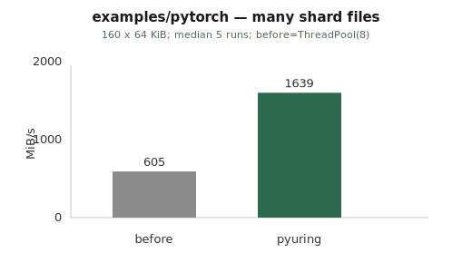
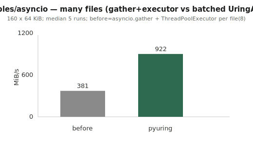
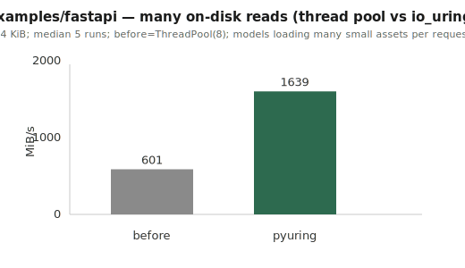

# Examples

Each subdirectory is a **before / after** pair: **`before/`** uses common Python I/O patterns; **`after/`** uses **pyuring** (`UringCtx`, `read_async` / `write_async`, and where relevant **`UringAsync`** for asyncio). **Linux only** (io_uring).

---

## `asyncio/`

| | |
|--|--|
| **Problem** | Blocking `read()` would stall the event loop; typical fix is **`run_in_executor`** / **`asyncio.to_thread`**. |
| **`before/read_file.py`** | One temp file; **`await loop.run_in_executor(None, …)`** runs blocking **`open().read()`** in a thread. |
| **`after/read_file.py`** | **`UringCtx`** + **`read_async`** (64 KiB blocks); **`UringAsync.wait_completion()`** on the ring’s completion fd (**`add_reader`**). No thread pool on the read path. |

---

## `fastapi/`

| | |
|--|--|
| **Pattern** | Handler must not block the loop while reading from disk. |
| **`before/main.py`** | **`GET /payload`** → **`await run_in_executor(None, Path.read_bytes)`**; **lifespan** writes **`sample_payload.bin`**. Port **8765**. |
| **`after/main.py`** | Same route; **lifespan** builds **`UringCtx` + `UringAsync`**, stores on **`app.state`**; handler uses the same **`read_async`** pattern as `asyncio/after`. Port **8766**. |

---

## `pytorch/`

| | |
|--|--|
| **Pattern** | Many shard files per step (DataLoader-like I/O shape; **no `torch` import**). |
| **`before/load_shards.py`** | **`ThreadPoolExecutor.map`** + per-file **`read()`**. |
| **`after/load_shards.py`** | One **`UringCtx`**, batched **`read_async`**, **`submit` / `wait_completion`** until done. |

---

## Results

**Scope:** these graphs measure **multi-file** read throughput (generated by **`scripts/gen_example_graphs.py`**). They are **not** the one-file demos above: **`asyncio/`** and **`fastapi/`** samples use a **single** file so the code diff stays small. **`pytorch/`** example code is already “many files,” same idea as the first chart.

**MiB/s** = total bytes ÷ wall time; **median of 5** runs. Defaults: **160** files (pytorch/asyncio charts) or **192** (fastapi), **64 KiB** each, **`ThreadPoolExecutor(8)`** vs **`read_async`** batches of up to **32**. On a **hot cache**, one big **`read()`** in a thread can look better on MiB/s than many completions — the graphs use **many files** so **batched SQEs** are what you’re comparing.

| SVG | `before` | `pyuring` |
|-----|----------|-----------|
| [`example_pytorch_shards.svg`](../docs/graphs/example_pytorch_shards.svg) | `ThreadPoolExecutor` + sync `read` per file | Batched **`read_async`**, **`wait_completion`** |
| [`example_asyncio_many_files.svg`](../docs/graphs/example_asyncio_many_files.svg) | **`asyncio.gather`** + **`run_in_executor`** per file | Batched **`read_async`** + **`await UringAsync.wait_completion()`** |
| [`example_fastapi_many_reads.svg`](../docs/graphs/example_fastapi_many_reads.svg) | Same multi-file thread-pool vs batched io_uring bench (different **N** than row 1 — not HTTP/`curl` latency) | |

```bash
PYTHONPATH=. python3 scripts/gen_example_graphs.py
```

Tune **`SHARDS`**, **`SHARD_KB`**, **`URING_BATCH`**, etc. in that script if numbers on your machine need a different story.





---

## Run the sample code

```bash
export PYTHONPATH=.   # or: pip install -e .
python3 examples/asyncio/before/read_file.py
python3 examples/asyncio/after/read_file.py

pip install fastapi uvicorn
cd examples/fastapi/before && uvicorn main:app --host 127.0.0.1 --port 8765
cd examples/fastapi/after  && uvicorn main:app --host 127.0.0.1 --port 8766

python3 examples/pytorch/before/load_shards.py
python3 examples/pytorch/after/load_shards.py
```

Further reading: [`docs/`](../docs/), [`docs/graphs/`](../docs/graphs/).
